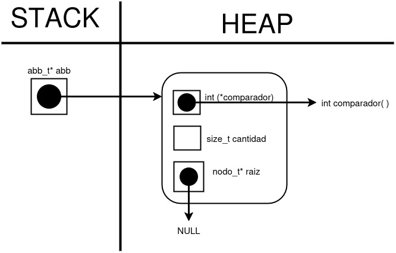
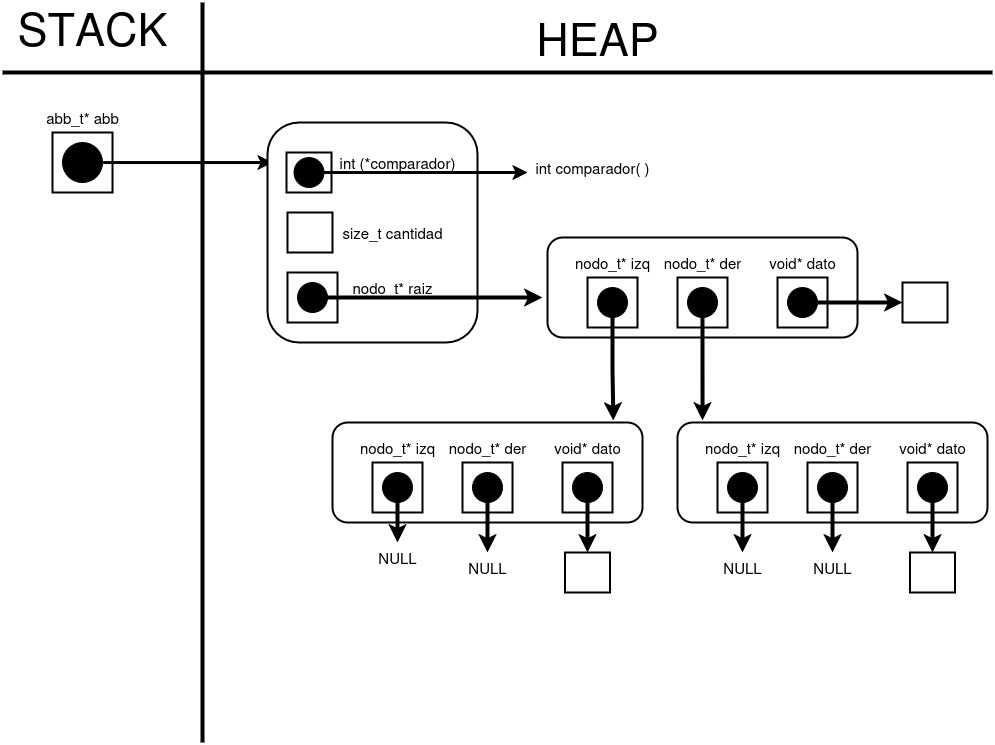
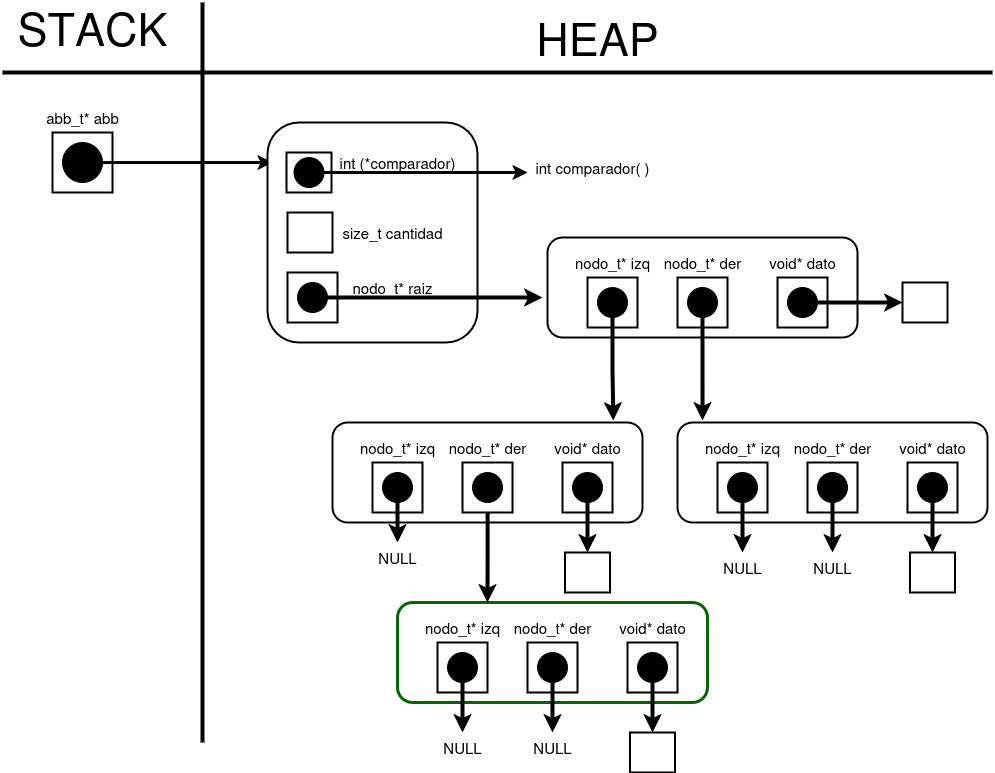
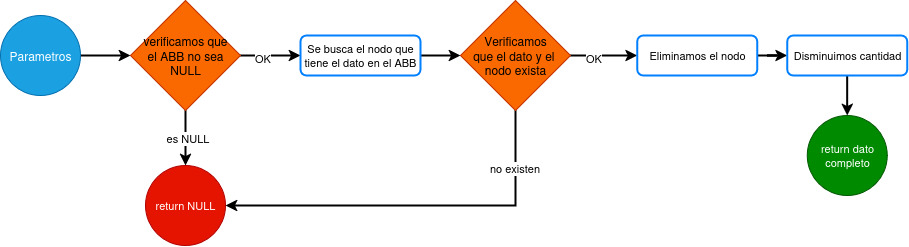
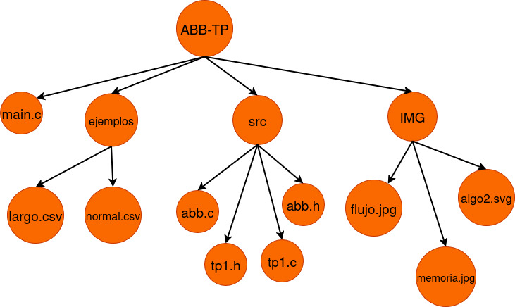
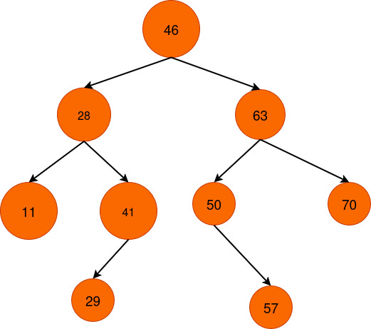

<div align="right">

</div>

# TDA ABB

## Repositorio de Qusisami Meza - 112954 - qmeza@gmail.com


- Para compilar:

```bash
make compilar-tp
```

- Para correr tests:

```bash
make test
```


- Buscar un Pokémon por nombre:
Se puede buscar un Pokémon específico en el archivo `.csv` indicando su nombre:
```bash
make buscar-nombre archivo=../mi_pokedex.csv nombre=mi_pokemon 
```
Aquí se reemplaza `../mi_pokedex.csv` por la ruta real de tu archivo CSV y `mi_pokemon` por el nombre del Pokémon que deseas buscar.

- Buscar un Pokémon por ID:
De manera similar, para buscar por ID:

```bash
make buscar-id archivo=../mi_pokedex.csv id=numero_id 
```
Se debe reemplazar `numero_id` por el número de identificación del Pokémon deseado.

- Ejecutar con Valgrind:
Para detectar posibles fugas de memoria, se puede correr cualquiera de las búsquedas con Valgrind:
```bash
make valgrind-buscar-nombre archivo=../mi_pokedex.csv nombre=mi_pokemon 
make valgrind-buscar-id archivo=../mi_pokedex.csv id=numero_id 
```

---

## Introducción
En el programa `main.c` que se ha implementado se lee un archivo `.csv` que contiene pokemones con su respectiva información. Dicho archivo se procesa y los pokemones válidos se almacenan en un árbol binario de búsqueda. El usuario puede realizar búsquedas por nombre o por ID: si el pokemon está en el árbol se muestra la información correspondiente y, en caso contrario, se informa al usuario que no se encontró.

Asimismo, se desarrolló la implementación de un árbol binario de búsqueda que permite su creación a partir de una función comparadora, la cual determina el orden de los elementos: los menores se ubican a la izquierda y los mayores a la derecha. Las operaciones de inserción, búsqueda y eliminación se realizan utilizando dicho comparador. Además, es posible procesar los elementos mediante el iterador interno o extraerlos en un vector, según el recorrido seleccionado (inorden, preorden o postorden).


---

##  Funcionamiento general de main.c

El programa recibe como parámetros un archivo `.csv`, la operación a realizar (actualmente solo búsqueda), el modo de búsqueda (por nombre o por ID) y el dato con el que se desea buscar.

A partir de esos parámetros se crea una estructura `comando_t` mediante la función `crear_comando()`. Esta estructura guarda el tipo de operación y un puntero a los datos necesarios para llevarla a cabo. Si los parámetros son incorrectos la estructura no se crea, se muestra un mensaje con la forma correcta de ejecución y el programa finaliza. Si en cambio los parámetros son válidos y corresponden a una operación implementada, se crean los datos asociados. 

En el caso particular de la búsqueda se genera una estructura `buscar_t` con la funcion `crear_datos_buscar`. Esta función primero lee el archivo con `tp1_leer_archivo`, que a su vez crea un `tp1_t`. Luego se construye una estructura `abb_t` según el tipo de seleccion con `abb_crear()` con su comparador correspondiente y, mediante `tp1_con_cada_pokemon()`, se recorren los pokemones del `tp1_t` y se agrega cada uno al árbol con `abb_insertar()`. Una vez definido el árbol, se guarda el dato buscado con el que se trabajará. Obviamente todo esto se realizará si el usuario coloca los parametros correctos y el archivo es correcto.

Con el comando ya creado correctamente se procede a ejecutarlo a través de `ejecutar_comando()`. En caso no realizarse, se informa por pantalla. Para la operación de búsqueda, la función `realizar_busqueda` identifica qué tipo de selección eligió el usuario y luego recurre a `abb_buscar`, para localizar el pokemón. Si el elemento se encuentra, se devolvuelve con toda la información del pokemon. En caso de no encontrarlo, se imprime por pantalla un mensaje de aviso.

Al finalizar la ejecución, sin importar si se realizó con exito o no el comando, se libera la memoria utilizada. Esto se hace con `destruir_comando` que en el caso de una búsqueda invoca a `destruir_busqueda` . Dicha función libera el `tp1` con `tp1_destruir` y destruye el árbol binario de búsqueda con `abb_destruir()`.

---

## Implementación de árbol binario de búsqueda

La estructura del árbol con la que se trabajó fue brindada en `abb_estructura_privada.h`. 

Para este trabajo se desarrollaron las funciones declaradas en `abb.h`, estas fueron:


- **abb_crear:**

    Crea e inicializa un árbol binario de búsqueda, reserva memoria y guarda el comparador no nulo. Devuelve el árbol o NULL si ocurre un error.
    En el siguiente diagrama se puede visualizar como quedaría la estructura recién creada.
    <br>

    <div align="center">
    
    </div>

    Como está recién creada vemos que la raíz apunta a `NULL`, en los siguientes diagramas (en abb_insertar) podremos ver como apunta a una estructura `nodo_t`, la cual contendrá los punteros a los siguientes nodos y al dato guardado.
    
- **abb_existe:**

    Verifica si un dato existe en el árbol. Busca recursivamente el nodo comparando los valores; si se encuentra, devuelve `true`, y `false` en caso contrario o si el árbol está vacío.
    <br>

- **abb_buscar:** 

    Busca un dato en el árbol comparando nodo a nodo y devuelve un puntero al mismo si se encuentra, o `NULL` si no está presente o si el árbol está vacío.
    <br>

- **abb_insertar:**

    Inserta un dato en el árbol de manera recursiva, si el nodo actual es `NULL`, crea uno nuevo; de lo contrario, compara el dato con el nodo y lo inserta en la rama izquierda o derecha según corresponda.
    
    Aquí se muestra cómo se agrega en memoria un nuevo nodo, primero tenemos un ABB con tres nodos. Siendo la raíz padre de dos hijos(nodos) y cada uno almacena su respectivo dato.
    
    <div align="center">
    
    </div>
    
    Después recursivamente se compara con cada nodo hasta llegar a uno vacio (apuntando a `NULL`) y se reserva memoria para agregar el nuevo nodo (resaltado en verde). Su posición se determina según el comparador, en este caso, el nodo nuevo es menor que la raíz pero mayor que su padre.
    <br>

    <div align="center">
    
    </div>


- **abb_raiz:** 

    Retorna el dato almacenado en la raíz del árbol binario de búsqueda.
    <br>

- **abb_cantidad:** 

    Calcula y devuelve la cantidad de elementos en el árbol binario de búsqueda. Cuenta recursivamente cada nodo, sumando los de las ramas izquierda y derecha.
    <br>

- **abb_esta_vacio:** 

    Determina si el árbol binario de búsqueda está vacío, devolviendo true si no existe o si no contiene nodos, y false en caso contrario.
    <br>

- **abb_con_cada_elemento:** 

    Aplica una función a cada elemento del árbol binario de búsqueda según el tipo de recorrido seleccionado. La función recibe un puntero al dato de cada nodo y un puntero extra que puede ser usado para pasar información adicional. Se cuentan y devuelven los nodos sobre los cuales la función se ejecuta.

    Los tipos de recorrido disponibles son:
    <br>

    · Inorden (`ABB_INORDEN`): primero se recorren los nodos de la rama izquierda, luego el nodo actual, y finalmente los de la rama derecha. Esto devuelve los elementos en orden ascendente según el comparador.

    · Preorden (`ABB_PREORDEN`): primero se procesa el nodo actual, luego la rama izquierda y finalmente la derecha. Es útil para copiar el árbol o guardar su estructura.

    · Postorden (`ABB_POSTORDEN`): primero se recorren las ramas izquierda y derecha, y al final se procesa el nodo actual. Se usa comúnmente para liberar memoria o destruir el árbol.
    <br>

- **abb_vectorizar:** 

    Extraer los elementos del árbol binario de búsqueda en un vector según el tipo de recorrido seleccionado. Utiliza un recorrido inorden, preorden o postorden, y agrega cada dato al vector hasta alcanzar el límite especificado. Devuelve la cantidad de elementos agregados exitosamente al vector.
    <br>

- **abb_eliminar:** 

    Elimina el nodo que contiene el dato que queremos eliminar del árbol. El diagrama de flujo siguiente representa el proceso de `abb_eliminar`. Primero se obtiene el nodo que contiene el dato que el usuario quiere eliminar, si este existe en el ABB entonces se procederá a eliminar.
    <br>

    <div align="center">
    
    </div>

    Para eliminar un nodo, primero se recorre recursivamente el árbol comparando el dato almacenado en cada nodo con el que se desea eliminar. Al llegar al nodo correspondiente, este se reemplaza por su hijo predecesor inorden, su único hijo o por `NULL`, según corresponda. Finalmente, se libera la memoria del nodo eliminado o del predecesor.

- **abb_destruir:** 

    Libera la memoria del árbol binario de búsqueda sin aplicar ningún destructor a los datos almacenados, dejando los elementos contenidos intactos.
    <br>


- **abb_destruir_todo:** 

    Libera la memoria del árbol y, opcionalmente, aplica una función destructor a cada dato almacenado en los nodos antes de liberar la estructura, asegurando que no queden fugas de memoria.

---


## Respuestas a las preguntas teóricas


-   **Explique teóricamente (y utilizando gráficos) qué es una árbol, árbol binario y árbol binario de búsqueda. Explique cómo funcionan y de ejemplos de utilización de cada uno.**


**¿Qué es un árbol?**

   Un árbol es una estructura que sirve para almacenar datos de forma jerárquica. Está formado por una colección de nodos, cada uno de los cuales puede apuntar a otros nodos, por eso también se dice que es una estructura recursiva.
   El árbol tiene un nodo principal, llamado raíz, que es el primer nodo y desde el cual se conectan los demás nodos. Si lo pensamos de manera recursiva, los nodos que cuelgan de la raíz forman subárboles. Los nodos que no tienen hijos se llaman hojas.
   Cada nodo puede ser padre, hijo o ambos, y el único nodo que nunca es hijo es la raíz.
    
**Funcionamiento:**
El funcionamiento del árbol se basa en la recursividad, ya que cada subárbol puede considerarse un árbol independiente con su propia raíz y nodos asociados. Gracias a esto, se pueden realizar operaciones como inserción, búsqueda, eliminación y recorrido de manera eficiente.


**Ejemplos de utilizacion:**
- Representar jerarquías, como carpetas y archivos:
<div align="center">

</div>


**¿Qué es un arbol binario?**

Un árbol binario es un tipo de árbol en el que cada nodo puede tener como máximo dos hijos.

**Funcionamiento:**
Cada nodo puede tener un hijo izquierdo y un hijo derecho, o ninguno.
Se recorren los nodos siguiendo algún criterio de recorrido (preorden, inorden, postorden) para procesar o buscar información.
La estructura facilita recorridos y búsquedas más organizadas que un árbol genérico.

**Ejemplos de utilizacion:**
- Organización de datos alfabéticos en un árbol binario, en el siguiente gráfico se observa la disposición de los nodos sin un orden específico.

<div align="center">

</div>

    
**¿Qué es un arbol binario de búsqueda?**

Un árbol binario de búsqueda (ABB) es un árbol binario que guarda los datos de manera ordenada para que la búsqueda sea más eficiente.

En un ABB, según el criterio de comparación que usemos, los elementos menores se colocan a la izquierda y los elementos mayores a la derecha. Esto permite encontrar rápidamente un elemento sin recorrer todo el árbol.

**Funcionamiento:**

Para insertar un dato, se compara con el nodo actual y según su valor se decide si se ubicará en el subárbol izquierdo o derecho.

Al buscar un dato, se sigue el mismo criterio, avanzando por la rama correspondiente hasta localizar el elemento o llegar a un nodo hoja, lo que indica que el dato no está existe.

Para eliminar un nodo, se reorganizan los nodos del árbol de manera que se mantenga el orden, reemplazando el nodo eliminado por su hijo, su predecesor inorden, o NULL cuando corresponde.

**Ejemplos de utilizacion:**
- Ordanización de datos por una representación numérica. A comparación del diagrama anterior, en este podemos ver que sí está organizado de menor a mayor.

<div align="center">

</div>


-   **Explique la implementación de ABB realizada y las decisiones de diseño tomadas (por ejemplo, si tal o cuál funciones fue planteada de forma recursiva, iterativa o mixta y por qué, que dificultades encontró al manejar los nodos y punteros, reservar y liberar memoria, etc).**

    Todas las funciones del ABB fueron implementadas de manera recursiva. Esta decisión se tomó porque para un árbol binario de búsqueda es recomendable utilizar recursión, ya que la estructura del árbol es naturalmente recursivo. Cada nodo puede considerarse como la raíz de un subárbol, lo que facilita insertar, buscar, eliminar y recorrer elementos de forma clara y ordenada. Además, la recursión permitió practicar y reforzar el pensamiento recursivo, consolidando conceptos de manejo de nodos y punteros.

    La mayor dificultad fue coordinar correctamente las operaciones sobre los nodos y anticipar cómo cada acción afectaría a los hijos y al nodo actual. Esto generó preguntas como:

    “¿Cómo hago para que esto afecte primero a los hijos y después al nodo actual?”

    “¿Qué debería pasar si un nodo no cumple cierta condición?”

    “¿Qué tipo de dato es adecuado para declarar la función recursiva?”

    “¿Funcionará correctamente con muchos nodos?”

    Personalmente, suelo evitar usar funciones recursivas porque a veces sobrepienso cada paso y pierdo de vista el inicio, por lo que este trabajo práctico fue una buena oportunidad para practicar y comprender mejor la recursión aplicada a estructuras de árbol.

-   **Explique la complejidad de las operaciones del .h implementadas para el TDA.**

- **abb_crear:** Su complejidad es O(1) porque reservar memoria y asignar el comparador son constantes.

- **abb_insertar:** Si el árbol está balanceado la complejidad sería O(log n), si no está balanceado en el peor de los casos sería O(n) ya que recorrería todos los elementos. Las verificaciones y la reserva de memoria son constantes asi que no afecta.

- **abb_existe:** Si el árbol está balanceado la complejidad sería O(log n), si no está balanceado en el peor de los casos sería O(n) ya que recorrería todos los elementos. Las verificaciones son constantes asi que no afecta.

- **abb_buscar:** Si el árbol está balanceado la complejidad sería O(log n), si no está balanceado en el peor de los casos sería O(n) ya que recorrería todos los elementos. Las verificaciones son constantes asi que no afecta.

- **abb_eliminar:** Si el árbol está balanceado la complejidad sería O(log n), si no está balanceado en el peor de los casos sería O(n) ya que recorrería todos los elementos. Las verificaciones y la liberacion de memoria son constantes asi que no afecta.

- **abb_raiz:** Su complejidad es O(1) porque verificar que esté vacio y obtener el dato es constante.

- **abb_cantidad:** Su complejidad es O(1) porque solo retorna la cantidad.

- **abb_esta_vacio:** Su complejidad es O(1) porque las verificaciones son constantes.

- **abb_con_cada_elemento:** Su complejidad es O(n) en el peor de los casos porque va recursivamente por cada elemento aplicando la funcion.

- **abb_vectorizar:** Su complejidad es O(n) en el peor de los casos porque va recursivamente por cada elemento agregandolo en el vector.

- **abb_destruir:** Su complejidad es O(n) porque tiene que liberar la memoria de cada nodo.

- **abb_destruir_todo:** Su complejidad es O(n) porque tiene que liberar la memoria de cada nodo y dato (si es el caso).

