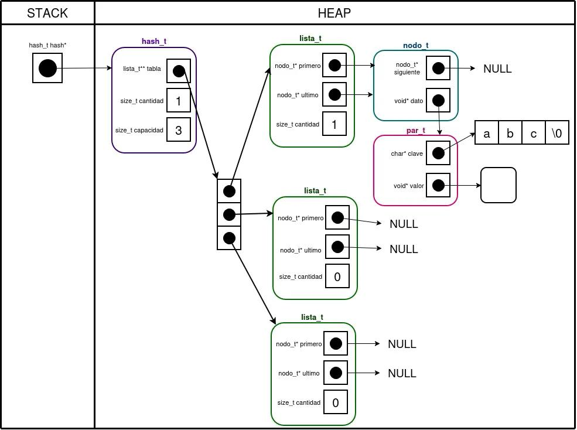
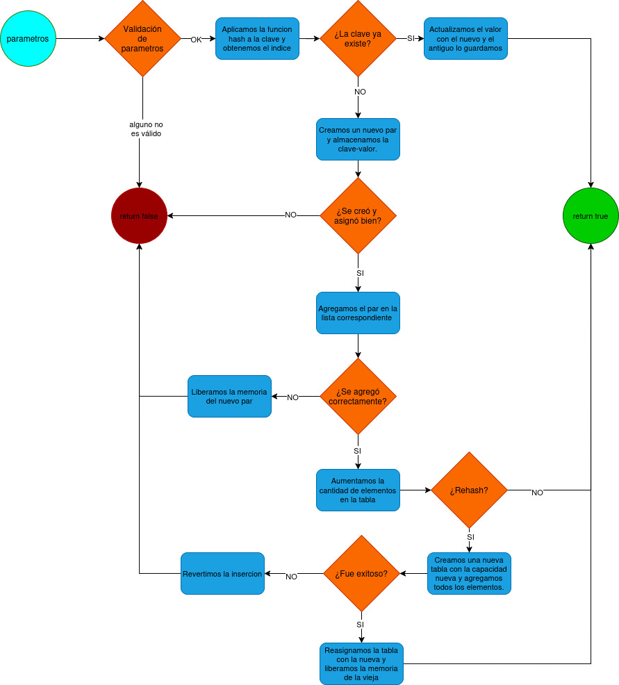
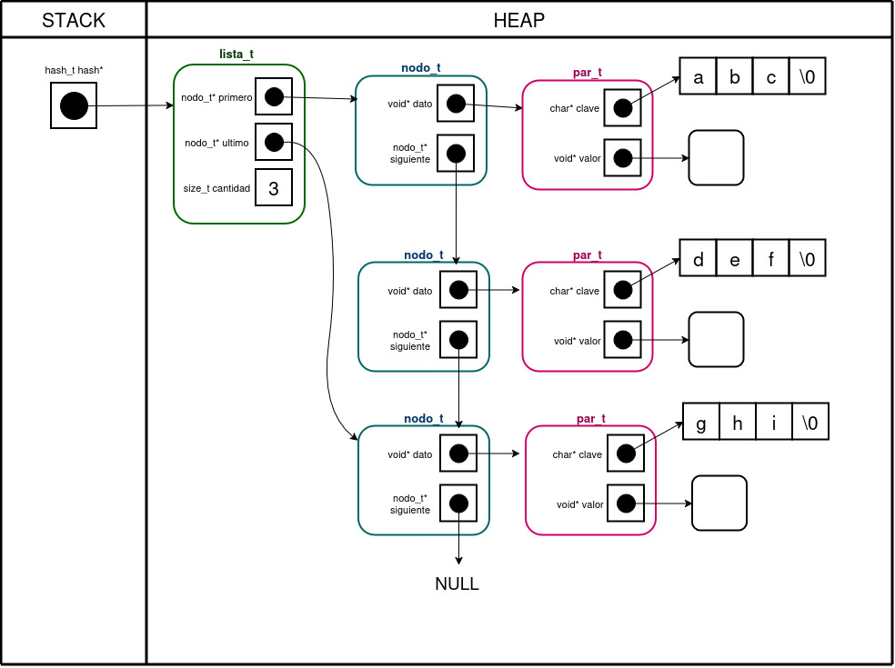
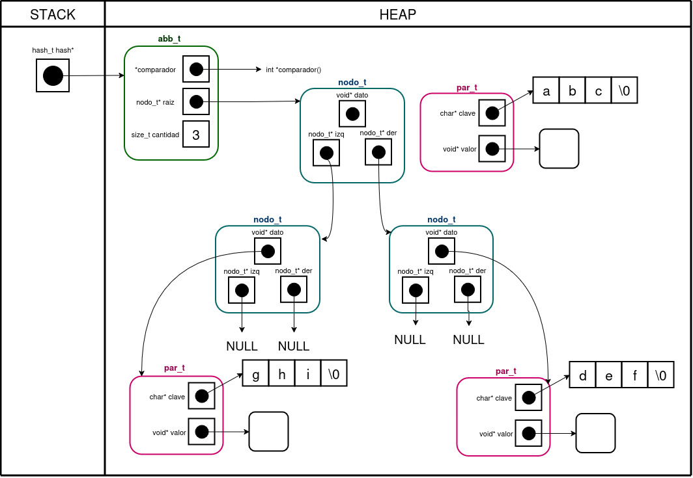
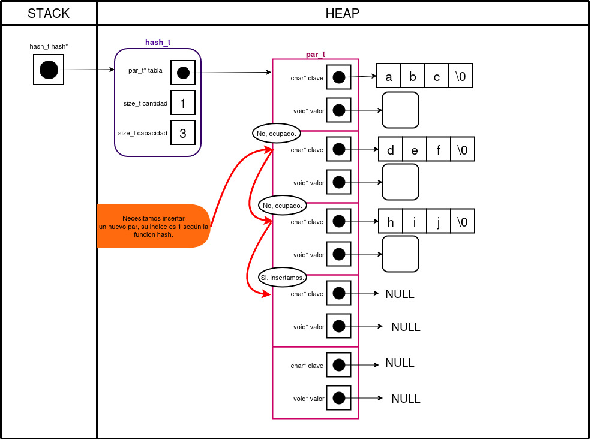

<div align="right">

</div>

# TDA HASH

## Repositorio de Qusisami Meza - 112954 - qmeza@fi.uba.ar

- Para compilar:

```bash
make compilar-tp
```

- Para correr tests:

```bash
make valgrind-alumno
```

- Buscar un Pokémon por nombre:
Se puede buscar un Pokémon específico en el archivo `.csv` indicando su nombre:
```bash
make buscar-nombre archivo=../mi_pokedex.csv nombre=mi_pokemon 
```
Aquí se reemplaza `../mi_pokedex.csv` por la ruta real de tu archivo CSV y `mi_pokemon` por el nombre del Pokémon que deseas buscar.

- Buscar un Pokémon por ID:
De manera similar, para buscar por ID:

```bash
make buscar-id archivo=../mi_pokedex.csv id=numero_id 
```
Se debe reemplazar `numero_id` por el número de identificación del Pokémon deseado.

- Ejecutar con Valgrind:
Para detectar posibles fugas de memoria, se puede correr cualquiera de las búsquedas con Valgrind:
```bash
make valgrind-buscar-nombre archivo=../mi_pokedex.csv nombre=mi_pokemon 
make valgrind-buscar-id archivo=../mi_pokedex.csv id=numero_id 
```

- Ejemplos de uso:
```bash
make buscar-id archivo=ejemplos/normal.csv id=4
make buscar-nombre archivo=ejemplos/normal.csv nombre=Squirtle 
```

---

## Introducción
En el programa `main.c` que se ha implementado se lee un archivo `.csv` que contiene pokemones con su respectiva información. Dicho archivo se procesa y los pokemones válidos se almacenan en una tabla hash abierta (con direccionamiento cerrado). El usuario puede realizar búsquedas por nombre o por ID: si el pokemon está en la tabla se muestra la información correspondiente y, en caso contrario, se informa al usuario que no se encontró.

Asimismo, se desarrolló la implementación de una tabla de hash que permite su creación a partir de una función de hash interna, la cual determina la posición de cada clave dentro de la tabla. Las claves utilizadas son strings no nulos, y los valores asociados son punteros a estructuras de tipo pokemon. Las operaciones de inserción, búsqueda y eliminación se realizan utilizando dicha función de hash y listas para el manejo de colisiones (direccionamiento cerrado). Además, es posible recorrer las claves almacenadas mediante un iterador interno que aplica una función recibida por parámetro sobre cada elemento de la tabla.

---

##  Funcionamiento general de main.c

El programa recibe como parámetros un archivo `.csv`, la operación a realizar (actualmente solo búsqueda), el modo de búsqueda (por nombre o por ID) y el dato con el que se desea buscar.

A partir de esos parámetros se crea una estructura `comando_t` mediante la función `crear_comando()`. Esta estructura guarda el tipo de operación y un puntero a los datos necesarios para llevarla a cabo. Si los parámetros son incorrectos la estructura no se crea, se muestra un mensaje con la forma correcta de ejecución y el programa finaliza. Si en cambio los parámetros son válidos y corresponden a una operación implementada, se crean los datos asociados. 

En el caso particular de la búsqueda se genera una estructura `buscar_t` con la funcion `crear_datos_buscar`. Esta función primero lee el archivo con `tp1_leer_archivo`, que a su vez crea un `tp1_t`. Luego se construye una estructura `hash_t` según la cantidad de pokemones en `tp1` con `hash_crear()` y, mediante `tp1_con_cada_pokemon()`, se rellena el hash con los pokemones del `tp1_t` y su clave según el tipo de seleccion (id o nombre) con `hash_insertar()`. Una vez definida la tabla hash, se guarda el dato buscado con el que se trabajará. Obviamente todo esto se realizará si el usuario coloca los parametros correctos y el archivo es correcto.

Con el comando ya creado correctamente se procede a ejecutarlo a través de `ejecutar_comando()`. En caso no realizarse, se informa por pantalla. Para la operación de búsqueda, la función `realizar_busqueda()` usa `hash_buscar()` para obtener el pokemon. Si el elemento se encuentra, se devolvuelve con toda la información del pokemon. En caso de no encontrarlo, se imprime por pantalla un mensaje de aviso.

Al finalizar la ejecución, sin importar si se realizó con exito o no el comando, se libera la memoria utilizada. Esto se hace con `destruir_comando()` que en el caso de una búsqueda invoca a `destruir_busqueda()` . Dicha función libera el `tp1` con `tp1_destruir` y destruye la tabla hash con `hash_destruir()`.


---

##  Implementación de tabla hash

Esta implementación se hizo con direccionamiento cerrado (hash abierto), por ende se usa otro TDA para almacenar los valores. En este caso se escogió usar una lista.

**Estructura interna hash abierto**
La estructura del hash se encuentra en `hash.c` y está compuesta por:
- `lista_t** tabla` : Un arreglo de listas , donde cada posición representa un “bucket”.
- `size_t capacidad` : Indica el tamaño actual de la tabla (cantidad de buckets).
- `size_t cantidad` : Indica la cantidad total de elementos almacenados.

En la siguiente imagen se muestra como se visualiza en memoria un hash abierto de capacidad tres con un elemento almacenado.

<div align="center">

</div>

**Función hash**
Se recomendó usar la funcion hash DJB2, asi que esa fue la usada en este trabajo.

**Primitivas del TDA hash**
Para este trabajo se desarrollaron las funciones declaradas en `hash.h`, estas fueron:
- `hash_crear()`: Reserva memoria para una estructura `hash_t` y la inicializa. Se crea con una capacidad mayor o igual a 3, según a esta capacidad se crea una tabla. En caso de que todo se cree bien, entonces se devolverá un hash abierto válido. **diagrama de memoria**
- `hash_cantidad()`: Devuelve la cantidad de clave-valor almacenados en la tabla. 
- `hash_insertar()`: Devuelve true si se pudo almacenaar exitosamente la clave-valor. En caso que  la clave ya exista, se reemplaza su valor y el antiguo se guarda en el puntero `void** encontrado` (si ese existe). En la siguiente imagen se muestra el flujo que sigue la función.

<div align="center">

</div>

- `hash_buscar()` : Busca el valor asociado a la clave pasada por parámetro y lo devuelve.
- `hash_contiene()` : Devuelve true hay una clave en el hash que coincida con la pasada por parámetro.
- `hash_quitar()` : Devuelve el valor asociado a la clave y lo elimina de la tabla.
- `hash_iterar()` : Recorre todas las claves-valores de la tabla hash y le aplica una funcion hasta quue devuelva false, se devulve la cantidad claves-valores iterados.
- `hash_destruir()` : Libera toda la memoria relacionada con `hash_t`.
- `hash_destruir_todo()` : Aplica el destructor a cada valor guardado en el hash y después libera toda la memoria relacionada con `hash_t`.


---

## Respuestas a las preguntas teóricas

- **¿Qué es un diccionario?**
   Un diccionario es una estructura de datos asociativa que almacena elementos en forma de pares clave–valor.
   Cada elemento se identifica por una clave única, y a través de esa clave se puede acceder al valor asociado.

- **Explicá 3 formas diferentes de implementar un diccionario (tabla de hash cuenta como 1 sola implementación posible)**

   1. **Lista enlazada:** Utiliza solo una lista, cada nodo de dicha lista puede contener una clave-valor. Por ejemplo, en este hash tiene 3 nodos, cada uno con un par clave-valor.

<div align="center">

</div>

   2. **Árbol binario de búsqueda:** Cada nodo del ABB contiene una clave-valor, cada par es ordenado según su clave de manera que el subárbol izquierdo tenga los pares menores y el derecho, mayores (o viceversa). En el siguiente diagrama se puede ver la implementación de un diccionario con un ABB.

<div align="center">

</div>

   3. **Tabla de Hash:** Usa una función de hash que transforma la clave en una posición dentro de una tabla.
Cada posición puede almacenar uno o más pares clave–valor.

 - **¿Qué es una función de hash y qué características debe tener para nuestro problema en particular?**
   Una función hash es una función que toma una clave y la convierte en un número entero, este entero se usa para representar un índice dentro de la tabla hash.
   Las características que tiene son:
   - Uniformidad: las claves deben distribuirse de forma pareja por toda la tabla.
   - Determinismo: la misma clave siempre produce el mismo índice.
   - Eficiencia: debe ser rápida de calcular.
   - Minimizar las colisiones: minimiza los casos en que dos claves diferentes dan el mismo índice (colisiones).

- **¿Qué es una tabla de Hash y los diferentes métodos de resolución de colisiones vistos (encadenamiento, probing, etc)?**
   Una tabla de Hash es un tipo de dato abstracto que almacena pares de clave-valor usando una función de hash para determinar su posición en la tabla. En ocasiones hay claves que obtienen el mismo índice, a esto se le llama colisión. Para su resolución se pueden aplicar diferentes métodos para su solución:
   - **Probing lineal:** Se busca la siguiente posición disponible en la tabla. Por ejemplo, en el siguiente diagrama vemos que se tiene que añadir un nuevo par clave-valor, este según la función hash le correspondría la posición 1. Sin embargo, esta ya está ocupada, por lo que se buscará la siguiente posición libre desde esa posición. En este caso, la siguiente será la posición 3.

<div align="center">

</div>

   - **Probing cuadrático:** En lugar de avanzar de uno en uno, se busca en posiciones que siguen una secuencia cuadrática. En este nuevo ejemplo la clave-valor le corresponde la posición 0, pero está ocupada. Entonces se tendrá que sumar de forma cuadrática desde su posición original. Como vemos, la posición 0+1² = 1 está también ocupada asi que irá a la posición 0+2² = 4 para ver si se puede insertar. Al estar vacía, la nueva clave-valor se insertará ahí.
<div align="center">

</div>

   - **Doble hash:** Usa una segunda función hash para determinar la distancia de salto entre posiciones.
   - **Encadenamiento:** Cada posición de la tabla apunta a una lista (u otro TDA) donde se almacenan todos los elementos que tienen el mismo índice.

- **Explique por qué es importante el tamaño de la tabla (tanto para tablas abiertas como cerradas)**

   - **Para tablas abiertas:** El tamaño de la tabla es importante porque afecta directamente el número promedio de elementos por lista (en esta implementación). Si la tabla es muy pequeña, habrá más posibilidades de colisiones y las listas serán más largas, tendiendo así a una complejidad O(n). Si la tabla es muy grande, se desperdicia memoria.
   - **Para tablas cerradas:** El tamaño de la tabla es importante ya que determina cuán rápido se llenará y qué tan fácil será encontrar posiciones libres. En el caso de que sea demasiado pequeña el factor de carga será cercano a 1 y habrá más posibilidades de haber colisiones, por ende se recorrerá la tabla en busca de un espacio libre. Si es demasiado grande, al igual que en la tabla abierta, se desperdicia memoria.

- **Dado que en una tabla abierta se pueden encadenar colisiones sin importar el tamaño de la tabla, ¿Realmente importa el tamaño?**
   Sí, como se mencionó anteriormente, si muchas claves obtienen el mismo índice, todas se almacenarán en la misma lista. En ese caso, al buscar un par clave-valor dentro de esa lista, será necesario recorrerla hasta encontrar el elemento, lo que hace que la complejidad de la operación tienda a O(n).
   Esto no es lo que se desea, ya que el objetivo de una tabla hash es mantener las operaciones en O(1) en promedio. Por eso, el tamaño de la tabla sigue siendo importante para lograr una buena distribución de las claves y mantener un bajo número promedio de colisiones.

   
