<div align="right">

</div>

# TDA LISTA/PILA/COLA

## Repositorio de Qusisami Meza - 112954 - qmeza@gmail.com

- Para compilar:

```bash
make compilar-tp
```

- Para buscar por nombre:

```bash
make buscar-nombre   #./main ejemplos/largo.csv buscar nombre A
```

- Para buscar por id:

```bash
make buscar-id   #./main ejemplos/largo.csv buscar id 1
```

- Para ejecutar con valgrind (buscar por nombre o id):
```bash
make valgrind-buscar-nombre
make valgrind-buscar-id
```

- Para correr tests:

```bash
make test
```

---
## Introducción
El programa implementado lee un archivo `.csv` que contiene pokemones con su respectiva información. Dicho archivo se procesa y los pokemones válidos se almacenan en una lista simplemente enlazada. El usuario puede realizar búsquedas por nombre o por ID: si el pokemon está en la lista se muestra la información correspondiente y, en caso contrario, se informa al usuario que no se encontró.


---
##  Funcionamiento general
El programa recibe como parámetros un archivo .csv, la operación a realizar (actualmente solo búsqueda), el modo de búsqueda (por nombre o por ID) y el dato con el que se desea buscar.

A partir de esos parámetros se crea una estructura `comando_t` cmediante la función `crear_comando()`. Esta estructura guarda el tipo de operación y un puntero a los datos necesarios para llevarla a cabo. Si los parámetros son incorrectos la estructura no se crea, se muestra un mensaje con la forma correcta de ejecución y el programa finaliza. Si en cambio los parámetros son válidos y corresponden a una operación implementada, se crean los datos asociados. 

En el caso particular de la búsqueda se genera una estructura `buscar_t` con la funcion `crear_datos_buscar`. Esta función primero lee el archivo con `tp1_leer_archivo`, que a su vez crea un `tp1_t`. Luego se construye una estructura `lista_t` con `lista_crear()` y extraer todos los pokemones en `tp1` con la funcion `tp1_con_cada_pokemon` y, mediante `tp1_con_cada_pokemon()`, se recorren los pokemones del `tp1_t` y se agrega cada uno a la lista con `lista_agregar()`. Una vez cargada la lista, se determina el tipo de búsqueda (por ID o por nombre) y se guarda el dato con el que se trabajará. Obviamente todo esto se realizará si el usuario coloca los parametros correctos y el archivo es correcto.

<div align="center">

</div>

<div align="center">
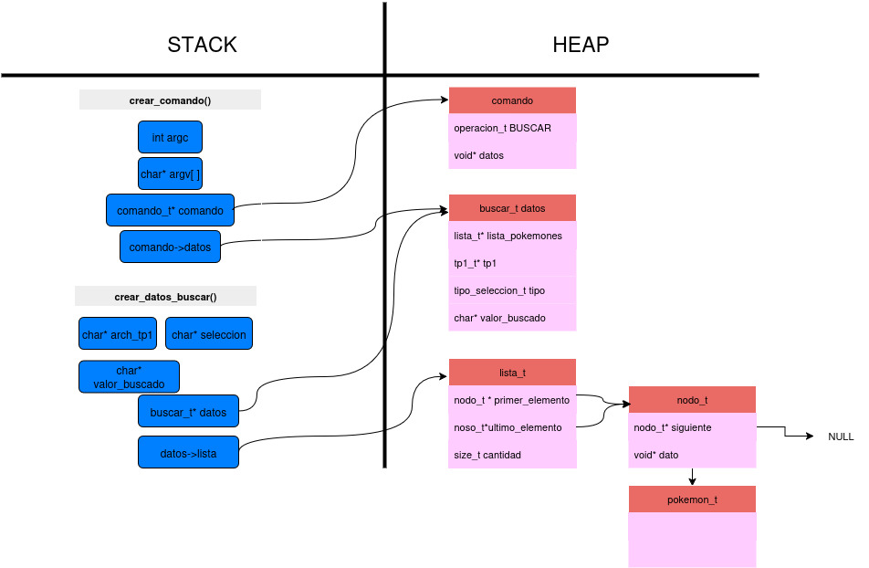
</div>

Con el comando ya creado correctamente se procede a ejecutarlo a través de `ejecutar_comando()`. En caso no realizarse, se informa por pantalla. Para la operación de búsqueda, la función `realizar_busqueda` dentifica qué tipo de selección eligió el usuario y luego recurre a `lista_buscar_posicion`,para localizar el pokemon. Si el elemento se encuentra, se obtiene con`lista_buscar_elemento` para finalmente devolvernos el pokemon. En caso de no encontrarlo, se imprime por pantalla un mensaje de aviso.

<div align="center">
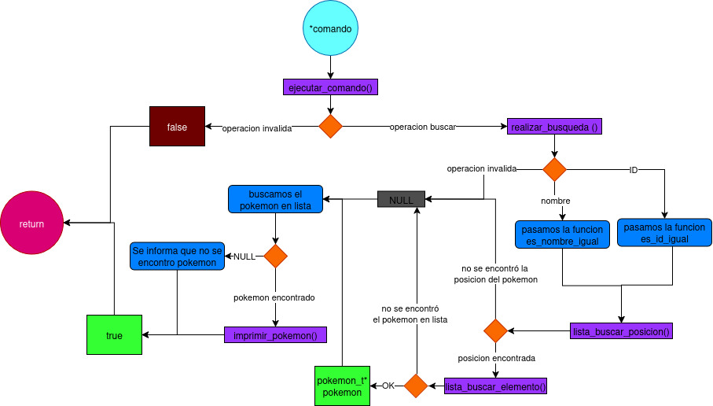
</div>

Al finalizar la ejecución, sin importar si se realizó con exito o no el comando, se libera la memoria utilizada. Esto se hace con `destruir_comando` que en el caso de una búsqueda invoca a `destruir_busqueda` . Dicha función libera el `tp1` con `tp1_destruir` y destruye la lista con `lista_destruir()`.


---
## Estructuras elegidas

Como se necesitaba hacer una lista simplemente enlazada, se decidió hacer lista_t como "cabecera" que almacenara un puntero al primer nodo (inicio de la lista), otro puntero al ultimo nodo y la cantidad de nodos que tiene la lista. 
Cada nodo tiene un puntero al nodo siguiente a este y otro puntero al dato que se desea almacenar. 
La razón por la cual se agregó un puntero al ultimo nodo es para cumplir el requisito de complejidad O(1) en las funciones de cola y pila.  

<div align="center">
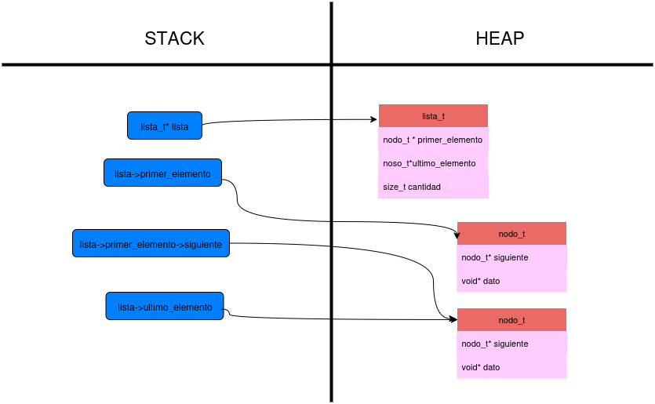
</div>

En el caso de pila y cola se usó una estructura de una lista porque se exigía reutilizar las funciones de lista.h
Para pila, el inicio de la lista vendría a ser el tope de la pila. Para cola, el inicio de la lista es el frente y el final, el final de cola.

<div align="center">
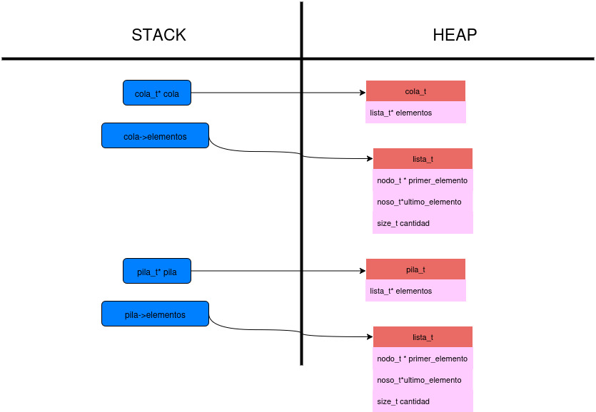
</div>


A continuacion explicare algunas funciones primitivas de lista más relevantes.

**- lista_insertar()**

Esta función permite insertar un nuevo elemento en la lista.
Primero valida que los datos sean correctos y crea un nodo que contendrá el elemento a insertar, en caso sean correctos.

- Inserción al inicio: si la posición indicada es la primera, el nuevo nodo apunta al nodo que antes era el primero de la lista. Luego, el puntero `primer_elemento` de la estructura `lista_t` se actualiza para que apunte a este nuevo nodo.
Gracias a esta implementación, la operación de inserción al inicio se realiza en tiempo constante O(1), lo cual es fundamental para garantizar las complejidades pedidas al reutilizar la lista como base de una pila o una cola.

- Inserción en otra posición: si la posición no es la primera, se recorre la lista hasta llegar al nodo inmediatamente anterior a la posición de inserción. Allí se ajustan los punteros para enlazar el nuevo nodo correctamente en la lista.

Finalmente, en cualquiera de los casos, se incrementa en uno la cantidad de elementos en la lista.

<div align="center">
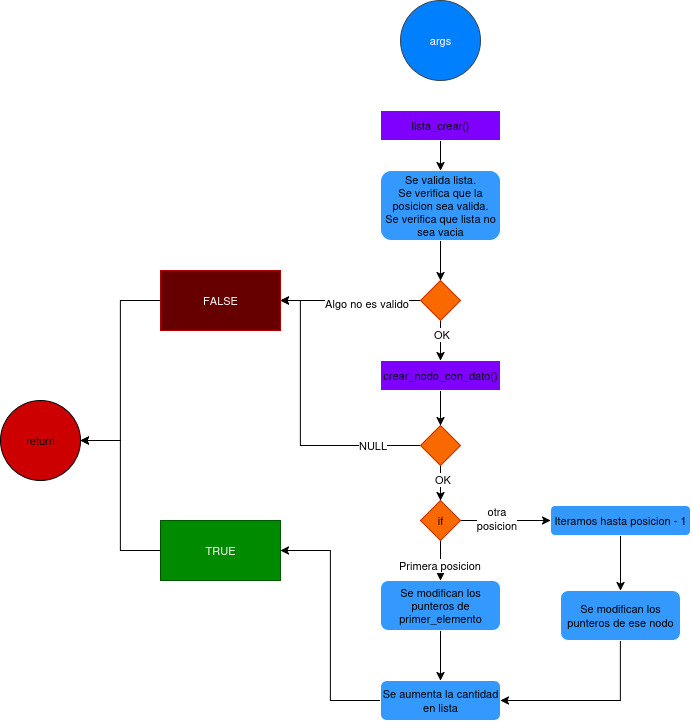
</div>

**- Implementacion de iterador externo**

Se crea con `lista_iterador_crear()` que crea una estructura `lista_iterador_t`, la cual mantiene un puntero al primer nodo de la lista. Si queremos obtener el elemento, primero se tendrá que verificar si es posible con `lista_iterador_hay_mas_elementos`, en caso sea posible, usamos `lista_iterador_obtener_actual` y así utilizamos el elemento como queramos. Para avanzar  al proximo nodo la funcion `lista_iterador_siguiente` modificará el puntero hacia el siguiente. 
Una vez terminemos de iterar, lo destruimos con `lista_iterador_destruir`.

<div align="center">
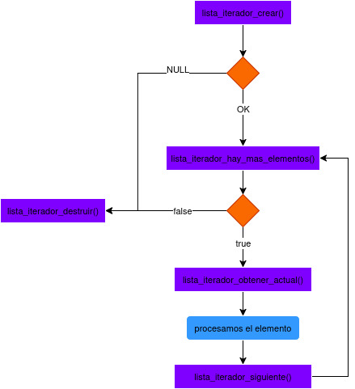
</div>


---

## Respuestas a las preguntas teóricas

**- Explicar qué es una lista, lista enlazada y lista doblemente enlazada.**
- Una lista es una colección de datos ordenados, donde cada dato se encuentra almacenado dentro de un nodo. Cada nodo guarda la información del elemento y, dependiendo del tipo de lista, puede contener uno o más punteros para enlazarse con otros nodos. Para recorrerla se comienza desde el primer nodo y se avanza de uno en uno hasta llegar al último, el cual apunta a `NULL` si no existen más elementos.

 - Una lista enlazada es aquella en la que cada nodo conoce únicamente al siguiente nodo. Esto permite recorrerla en una única dirección, desde el inicio hasta el final.

 <div align="center">
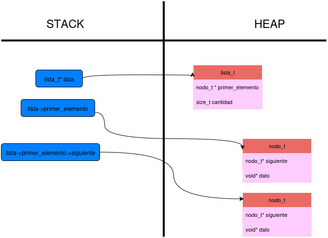
</div>

 - Una lista doblemente enlazada, al igual que una lista enlazada, cada nodo conoce al siguiente pero tambien conocen al anterior. Esto hace posible recorrer la lista tanto desde el inicio hasta el final como en sentido inverso.

 <div align="center">
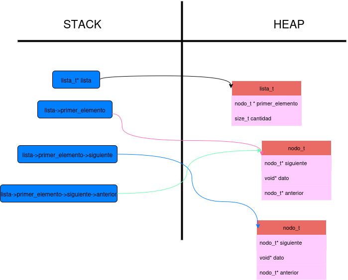
</div>

**- Explicar las características de cada una.**
1. Lista: 
  - Estructura dinamica conformada por nodos.
  - Cada nodo puede almacenar cualquier tipo de dato.
  - Puede ser enlazada, doblemente enlazada o circular.
2. Lista enlazada:
  - Cada nodo contiene un dato y un puntero al siguiente nodo.
  - Se puede recorrer en solo una direccion (de inicio a fin).
3. Lista doblemente enlazada: 
  - Cada nodo contiene un dato, un puntero al siguiente y al anterior a este.
  - Se puede recorrer en dos direcciones (de inicio a fin y de fin a inicio).

**- Explicar las diferencias internas de implementación.**
La principal diferencia entre una lista simplemente enlazada y una doblemente enlazada está en la estructura del nodo.

En una lista simplemente enlazada, cada nodo contiene un campo de datos y un puntero al siguiente nodo.

<div align="center">
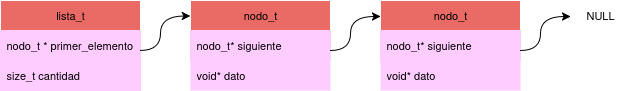
</div>

Mientras que en una lista doblemente enlazada, además de esos dos campos, cada nodo incluye un puntero extra que referencia al nodo anterior. 

<div align="center">
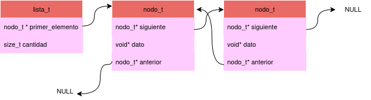
</div>

**- Explicar ventajas y desventajas de cada una, si existen.**
1. Lista enlazada:
  - **Ventajas**: 
    - Requiere menos memoria por nodo, ya que solo guarda un puntero al siguiente nodo (no contando el de datos).
    - Es más sencilla de implementar.

  - **Desventajas**:
    - Como el recorrido es unidireccional, no se puede volver hacia atrás sin volver al principio.
    - Dependiendo de la implementacion, para eliminar un nodo en el medio de la lista, normalmente se necesita acceso al nodo anterior, lo que implica un recorrido adicional.

2. Lista doblemente enlazada: 
  - **Ventajas**: 
    - Se puede recorrer en ambos sentidos (de inicio a fin y de fin a inicio).
    - Es más eficiente insertar o eliminar elementos en posiciones intermedias si ya se tiene una referencia al nodo, porque no es necesario volver a recorrer desde el principio para encontrar el anterior.

  - **Desventajas**:
    - Requiere más memoria, ya que cada nodo almacena dos punteros en lugar de uno (sin contar el de datos).
    - Su implementación es más compleja, ya que se debe tener cuidado en la asignacion de punteros del nodo anterior o siguiente.

**- Explicar qué es una lista circular y de qué maneras se puede implementar.**
Una lista circular es una lista en la que el último nodo no apunta a `NULL`, sino que enlaza nuevamente con el primer nodo. Esto permite recorrer la lista de manera continua, sin un punto final definido.

Su implementacion puede ser como lista enlazada o doblemente enlazada:
- Como lista simplemente enlazada circular, el último nodo apunta al primero. (en diagrama solo con flechas rosas)
- Como lista doblemente enlazada circular, el último nodo apunta al primero y el primero apunta al último.(en diagrama con flechas rosas y azules)

<div align="center">
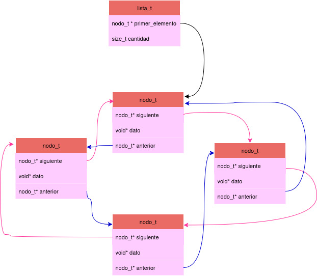
</div>

**- Explicar la diferencia de funcionamiento entre cola y pila.**
- Una de las diferencias más notables es la salida y entrada de elementos. Una pila es una estructura de tipo LIFO, osea el último elemento es el primero en salir. Mientras que una cola es una estructura de tipo FIFO, el primer elemento que entra es el primero en salir.

- Otra diferencia es el orden en el que se procesan los elementos, en una pila se trabaja sobre el último ingresado, mientras que en la cola se respeta el orden de llegada.

**- Explicar la diferencia entre un iterador interno y uno externo.**
Un iterador interno es el cual el usuario no controla el orden de recorrido, solo se le pasa una funcion al iterador y este se lo aplica a cada elemento. Por el contrario en un iterador externo el usuario puede avanzar elemento a elemento de la manera que desee. 
